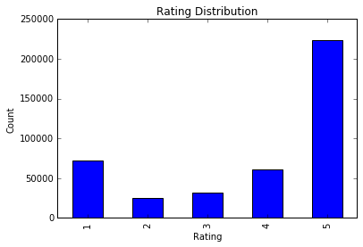
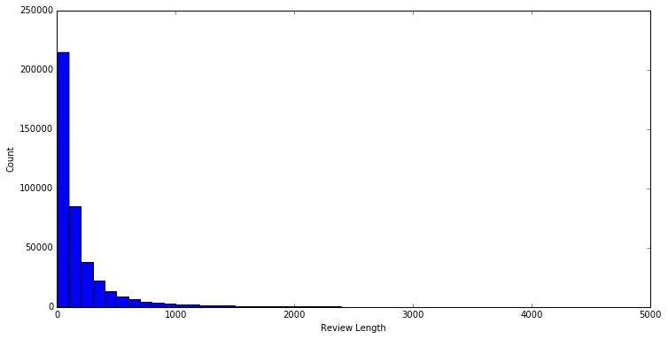
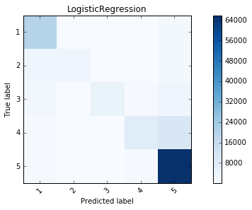
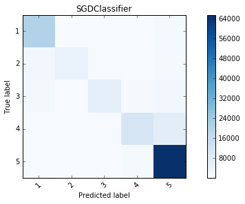

# Machine Learning Engineer Nanodegree
## Capstone Project

Garrison Jensen\
May 24th, 2017

## I. Definition

### Project Overview

Is it possible to predict the star rating of an Amazon review given the text of that review? I want to try to answer that question using a collection of 400,000 Amazon reviews of unlocked mobile phones as my dataset. I think it is interesting to see if the sentiment of a review can be decided from the text of the review itself.

The problem of determining the sentiment of text is not new. Research was done to try to extract sentiment from movie reviews [^1]. They tried to predict whether the review was positive or negative based on the text. They found that one of the main difficulties with sentiment extraction is that it requires more understanding of the text than traditional topic-based categorization. Topic-based categorization relies on finding keywords in text, however sentiment can be expressed more subtly.

[^1]: http://www.cs.cornell.edu/home/llee/papers/sentiment.home.html

### Problem Statement

The online store Amazon.com gives its users the ability review products in the form of a written review and a star rating between 1-5 stars. In this report, we try to predict the star rating given the written review.

To build our model we must complete the following tasks:

  1. Download and pre-process Amazon.com reviews of unlocked mobile phones.
  2. Extract features from the reviews.
  3. Train models to predict ratings.
  4. Refine the models.
  5. Compare/contrast final models.
  6. Discuss further possible improvements.

### Metrics

The metric we will use to measure the performance of our models is the F1-score. An F1 score is defined as follows:

$F1 = 2 \cdot \frac{precision \cdot recall}{precision + recall}$

$Precision = \frac{\text{True Positives}}{\text{True Positives} + \text{False Positives}}$

$Recall = \frac{\text{True Positives}}{\text{True Positives} + \text{False Negatives}}$

An F1-score is a popular metric to measure the performance of classifiers. An F1-score can be interpreted as a weighted average of precision and recall. [^2] The range of an F1-score is between 0 and 1, with the best score being 1.

Our dataset is asymmetrical. 54% of the Amazon ratings in our dataset are five stars; this means if a model always guesses five stars it would be right 54% of the time. We don’t want to favor models that guess five stars too often. This is why we are using the f1-score as our metric; it takes both false positives and false negatives into account. Using F1 scores to evaluate our models will allow us to favor models that have both high precision and recall.

[^2]: http://scikit-learn.org/stable/modules/generated/sklearn.metrics.f1_score.html#sklearn.metrics.f1_score

## II. Analysis

### Data Exploration

PromptCloud[^99] extracted 400,000 reviews of unlocked mobile phones from Amazon and provided the data on Kaggle.com. The data was extracted on December, 2016.

The data can be found online at the following web address: [https://www.kaggle.com/PromptCloudHQ/amazon-reviews-unlocked-mobile-phones](https://www.kaggle.com/PromptCloudHQ/amazon-reviews-unlocked-mobile-phones)

There are a few abnormalities in the data. First, there are empty reviews. It's impossible to leave a review without a rating, but it is possible to leave a rating without a review. When we clean the data we should remove these empty reviews.

Next, it’s also important to note that most reviews (over 50%) are 5-star reviews.  We need to take that into account when splitting our data into training and testing sets. It's important that we stratify the data, so we don't get uneven datasets.

_Table 1_ is a random sample from the dataset. We will look at these example reviews later to see how each model does against this sample.

[^99]: https://www.promptcloud.com/

#### Table 1: Example Reviews

|Rating|Reviews|
|------|-----------------------------------------------------------------|
|5|Excellent product! It's working in Chile with Argentinian and Italian SIM cards. Very good battery life (almost 7 days with regular use).|
|4|Purchased this phone for my son after breaking his iphone. We're pleased with the RCA and he hasn't had any issues with the phone, usage or connectivity and we're on the AT&T network.|
|4|My daughter loves her new phone.|
|2|Stopped working after 6 days. Amazon refunded money with no issues.|
|1|No lo recomiendo. No funciona en Venezuela. No viene con idioma español solo ingles y francés.Not recommend. Does not work in Venezuela.|
|3|I love the keyboard on the phone/and wifi, but the volume is not that great and earpiece did not work with phone.|

### Exploratory Visualization

Figure \ref{RatingDistribution} shows the distribution or ratings. Here we can see that there are many more 5-star ratings than other ratings. It's important that we take that into account when creating our training and testing sets or we may end up with too many 5-star reviews in one set.



Figure \ref{ReviewLengthDistribution} shows the distribution of review lengths. Notice that most of the review are relativity short, with very few above 200 characters. This is why it's important to take into account document length during feature extraction. We don't want long review to seem more relevant just because they are long.



### Algorithms and Techniques

We need an algorithm for feature extraction and some algorithms for classification. First, we will look at an algorithm for feature extraction, TF-IDF, and then we will look at three algorithms we will use as candidates for our classification algorithm: Logistic Regression, Gaussian Naive Bayes, and Stochastic Gradient Descent.

I chose these algorithms for performance reasons (these algorithms must run on a MacBook Pro with no GPU), these algorithms scale well to large datasets and large feature sets.

#### TF-IDF

We are going to use __term frequency–inverse document frequency__ (TF-IDF)[^5] as our feature extraction strategy. TF-IDF takes into account document length and term frequency when building features. We don't want long reviews to seem more relevant just because they are long, we also don't want to overvalue words that appears many times but do not provide very much information. TF-IDF weights the words based on it's frequency in the document and the document length.

$\text{TF/IDF} = \text{Term Frequency} \times \text{Inverse Document Frequency}$

TF-IDF uses a bag of words with weights to represent a document. However, this will miss some relationships between words. For example "not good" and "very good" both contain the word "good" but one is has the inverse meaning. We can help fix this problem using the `ngram_range` option in sklearns implementation of TD-IDF. `ngram_range` allows us to set the number of words that can be considered together. Setting this correctly will take some guessing and checking.

#### Logistic Regression

We are going to use sklearns implementation of logistic regression [^3] as our benchmark. 

Logistic regression is a classification algorithm (not a regression algorithm). Logistic regression takes a vector of features and transforms it into a probability by feeding it into a sigmoid function. Given a set of training points logistic regression will try to find a vector of weights that when multiplied to the set of features and fed into the sigmoid function we get an accurate prediction.

Even though logistic regression can only handle binary classification problems, sklearns implementation gives us the option to use a _One-vs-Rest_ technique; it trains against each class one at a time with all other samples counted as negative examples. This makes logistic regression a linear model capable of multiclass classification. 

#### Gaussian NB

MultinomialNB is a naive Bayes classifier. Naive Bayes algorithms are used extensively in text classification problems. They are highly scalable, in fact, MultinomialNB is $O(n)$ (n=training samples size) in training time.

Naive Bayes algorithms are based on Bayes rule: $P(A|B) = \frac{P(B|A)P(A)}{P(B)}$

Here is a more concrete example of this rule:

$P(\text{Review is 5-stars}|\text{Contains phrase B}) = \frac{P(\text{Contains phrase B}|\text{Review is 5-stars})P(\text{Review is 5-stars})}{P(\text{Contains phrase B})}$

Training MultinomialNB is fast because there is not much to do, almost all of the work is done in the predicting step when we have to calculate the equation above for every phrase in each review.

#### SGD classifier

SGDClassifier is a very efficient algorithm that uses _stochastic gradient descent_ to build a model. SGDClassifier isn't the model itself; it's a method of building a model. We can specify which model we want to build using the `loss` parameter.

SGDClassifier tries to find minima or maxima of the loss function by iterating over random samples from the training data. This is faster than training over all the training data. This makes SGDClassifier scalable, and a perfect candidate algorithm for our problem.

### Benchmark

We are going to use sklearns implementation of logistic regression [^3] as our benchmark. For the benchmark, we are not going to do any parameter tuning; we are going to use sklearns default parameters. As we will see, logistic regression does fairly well right out of the box.

```python
benchmark_linear_model = LogisticRegression().fit(X_train, y_train)
f1_score(y_test, benchmark_linear_model.predict(X_test), average='weighted')
```

With the default implementation we achieve an F1-Score of __`0.7862`__.

[^3]: http://scikit-learn.org/stable/modules/generated/sklearn.linear_model.LogisticRegression.html

## III. Methodology

### Data Preprocessing

There are several preprocessing steps we need to take before training. First, sometimes people leave ratings without reviews. We are going to ignore empty reviews:

```python
data = data[data['Reviews'].isnull()==False]
```

Next, some of the reviews have some formatting that we want to get rid of. We also want to remove all characters not in the English alphabet (including punctuation) and set everything to lowercase:

```python
def clean_text(string):
    review_text = BeautifulSoup(string, "lxml").get_text()
    string = re.sub("[^a-zA-Z]"," ", string)
    string = string.lower()
    return string
```
[^4]

At this point each review is a bunch of lowercase words. Now we need to do some kind of feature extraction. As stated in _Algorithms and Techniques_, we are going to use TF-IDF as our extraction algorithm.

```Python
vectorizer = TfidfVectorizer(
    min_df=2,               # Ignore phrases that are in fewer than 2 reviews
    max_df=0.95,            # Ignore phrases that are in 95% of reviews
    ngram_range = (1,4),    # Take phrases between 1 and 4 words
    stop_words = 'english') # Remove common English words

# Extract features from reviews.
review_features = vectorizer.fit_transform(reviews)
```

Finally, we can look at what TF-IDF considers the most relevant phrases. 

- Top 8 most relevant phrases:
	* 'music'
	* 'verizon'
	* 'year'
	* 'gb'
	* 'happy'
	* 'great phone'
	* 'great'
	* 'got'

Great! We know we are on the right track because these phrases intuitively seem relevant. We also look at the word cloud in figure \ref{WordCloud} and see some similarities between the two.

[^4]: BeautifulSoup is a Python library for pulling data out of HTML and XML files. We are using it here to get the text from the reviews without the xml formatting. 
[^5]: http://scikit-learn.org/stable/modules/generated/sklearn.feature_extraction.text.TfidfVectorizer.html

### Implementation

We are going to use a _Multinomial Naive Bayes_ classifier and a _Stochastic Gradient Descent_ classifier to predict ratings. We are going to use sklearn’s implementation of these algorithms. Both are relatively simple to use; the tricky part is parameter tuning which we will get to in _Refinement_.

If we use sklearn's default implementation of these algorithms we can achieve the following F1-Scores:

| Algorithm: | MultinomialNB | SGDClassifier |
|------------|---------------|---------------|
| F1-Score:  | 0.6460        | 0.6100        |

### Refinement

Parameter tuning was done using sklearn’s GridSearchCV algorithm; GridSearchCV does an exhaustive search over specified parameter values. 

#### MultinomialNB

MultinomialNB is a naive Bayes classifier. Naive Bayes algorithms are used extensively in text classification problems. They are highly scalable, in fact, MultinomialNB is $O(n)$ (n=training samples size) in training time.

MultinomialNB has an alpha hypterparamter that we will set using GridSearchCV. The alpha paramter determines what value we give the when we see a feature that we haven't encountered in the testing data. We can't use `0` because MultinomialNB multiplies these probabilities together and our whole prediction becomes `0`. For example, if we find a 5-star review with a single word that we've never seen in a 5-star review before we don't want our prediction to be `0`.

```python
parameters = { 'alpha': [0.1, 0.25, 0.5, 0.75, 1.0, 1.25, 1.5, 1.75, 2] }
clf1 = GridSearchCV(MultinomialNB(), parameters)
clf1.fit(X_train, y_train)
```

#### SGDClassifier

SGDClassifier is a very efficient algorithm that uses _stochastic gradient descent_ to build a model. SGDClassifier isn't the model itself; it's a method of building a model. We can specify which model we want to build using the `loss` parameter.

SGDClassifier has many hypterparamters to play with; we are going to tune 4 parameters: alpha, n_iter, penalty, and loss. The alpha parameter is a constant that multiplies the regularization term, n_iter is the number of passes over the training data, the penalty parameter is the regularization term, and loss is the loss function (the model to train).

The SGDClassifier guide on sklearn's site[^6] gives some reasonable ranges to search over for alpha and n_iter. It recommends the range `10.0**-np.arange(1,7)` for alpha and `np.ceil(10**6 / n)` (n is the size of the training set) as a first guess for n_iter. Since our training size has `289,645` rows, it recommends a n_iter of 3, so we are going to try a couple of values around 3. For penalty, we are just going to try every possible value. Finally, we are going to try three loss functions: `hinge` (linear SVM), `log` (logistic regression), `perceptron` (perceptron algorithm).

```python
parameters = [{ 'loss': ['hinge', 'log', 'perceptron']
              , 'alpha': 10.0**-np.arange(1,7)
              , 'penalty': ['l1', 'l2', 'elasticnet']
              , 'n_iter': [1,2,3,4,5]
              }]
clf2 = GridSearchCV(SGDClassifier(), parameters)
clf2.fit(X_train, y_train)
```

[^6]: http://scikit-learn.org/stable/modules/sgd.html#tips-on-practical-use

## IV. Results

### Model Evaluation and Validation

We save 30% of the data for testing. Now we can compare the models by seeing their performance on this data. We can look at their F1-scores, and, to help us visualize their performance, their confusion matrices.

#### F-Scores

```text
LogisticRegression:
             precision    recall  f1-score   support

          1     0.7775    0.9228    0.8439     21701
          2     0.9449    0.3886    0.5507      7417
          3     0.8867    0.4376    0.5860      9529
          4     0.8280    0.4123    0.5505     18412
          5     0.8085    0.9818    0.8868     67074

avg / total     0.8201    0.8098    0.7862    124133

MultinomialNB:
             precision    recall  f1-score   support

          1     0.8572    0.9091    0.8824     21701
          2     0.9322    0.6029    0.7323      7417
          3     0.8781    0.5940    0.7086      9529
          4     0.8530    0.5527    0.6708     18412
          5     0.8385    0.9744    0.9014     67074

avg / total     0.8526    0.8491    0.8390    124133

SGDClassifier:
             precision    recall  f1-score   support

          1     0.8529    0.9333    0.8913     21701
          2     0.9223    0.6288    0.7478      7417
          3     0.8791    0.6374    0.7390      9529
          4     0.8527    0.5853    0.6942     18412
          5     0.8663    0.9787    0.9191     67074

avg / total     0.8663    0.8653    0.8568    124133
```

#### Confusion Matrices

\

\

\


These confusion matrices tell us that the models have an easier time with the 5-star and 1-star reviews than the other reviews. Reviews with 5-star and 1-star are probably more straightforward because people who write these reviews use very distinct words. 

It’s clear from both the F1-score and confusion matrices that the stochastic gradient descent model outperforms the others.

### Justification

The final stochastic gradient descent learning model (SGDClassifier) has a F1-Score of `0.8568`, this is much better than the benchmark model which has a score of `0.7862`. We can look at the example reviews from _Table 1_ and see how each classifier did:

#### Table 2: Predictions on Example Reviews

|Rating|LR|MNB|SGD|Review|
|---|---|---|---|---|
|5|5|5|5|Excellent product! It's working in Chile with Arge...|
|4|5|5|5|Purchased this phone for my son after breaking his...|
|4|5|5|5|My daughter loves her new phone.|
|2|1|2|2|Stopped working after 6 days. Amazon refunded mone...|
|1|5|5|5|No lo recomiendo. No funciona en Venezuela. No vie...|
|3|3|4|3|I love the keyboard on the phone/and wifi, but the...|

We can see that the classifiers have a hard time differentiating between 4 and 5 star reviews and 2 and 1 star reviews. One of the reviews has Spanish words, almost all the reviews are English so it's not surprising that that all three classifier got that predictions wrong.

The final model does a good job of finding the general sentiment of a review. If you want to determine if a review is positive or negative, then this model is probably good enough. If you want a model that can differentiate between similar star ratings (like 3-star and 4-star reviews), then more work needs to be done. 

## V. Conclusion

### Free-Form Visualization

#### Word Cloud

When we look at the top phrases from TF-IDF we should see some similarities with the following generated word cloud:


### Reflection

To create this model I took the following steps:

  1. The data was downloaded and cleaned.
  2. Features were extracted from the review text.
  3. The data was split into testing and training sets.
  4. A benchmark classifier was created.
  5. Several classifiers were trained against the data using automated parameter tuning.
  6. The models were tested against the testing data.
  7. The models were compared using F1-scoring as a metric.

I found feature-extraction and parameter tuning as the most complicated steps in this project. The performance of my models was not very good until I decided to use the `ngram_range` parameter in the feature extraction algorithm to extract phrases from the text rather than just words. For parameter tuning, I had to research and find useful parameters and ranges to use for tuning. `SGDClassifier` performed poorly with the default penalty parameter; it wasn’t until I added the parameter to the grid
search that it started performing well.

### Improvement

All three models have low recall on reviews with star ratings between 2 and 4. Even for a human, it’s difficult to differentiate between these reviews. The difference between a 3-star and 4-star review is very subtle. A good place to look for improvements are ways to improve recall for these mid-star reviews.

A solution not explored in this report is a neural network. Many people have found success using neural networks for text classification problems. A good candidate would be the use of the Keras[^7] python library. Keras neural network library that would be useful in building a neural network model to predict ratings.

[^7]: https://keras.io/
